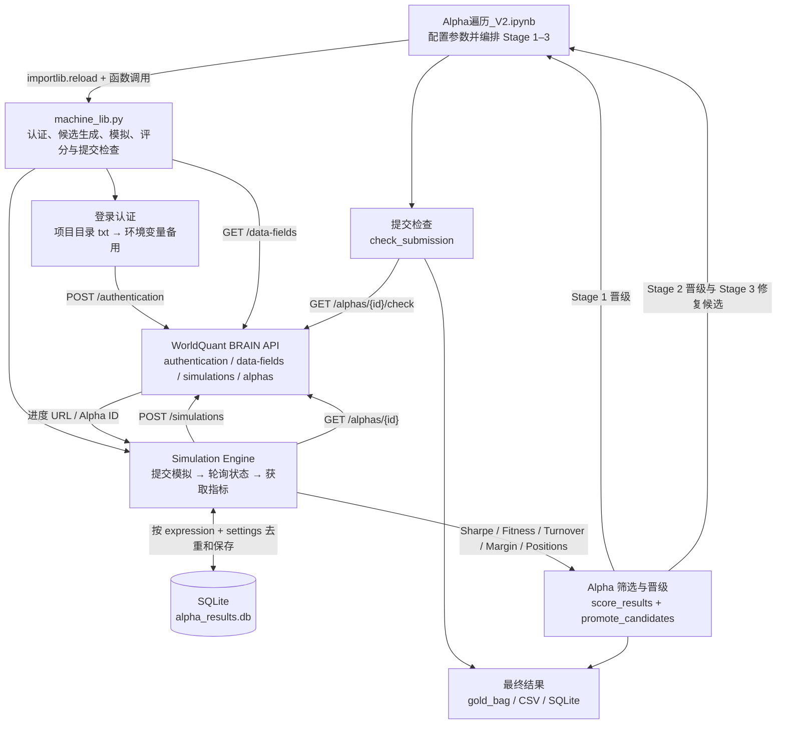
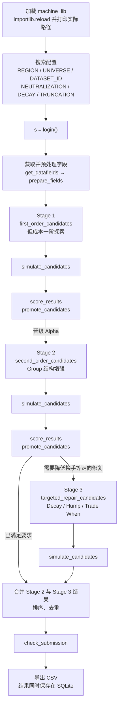
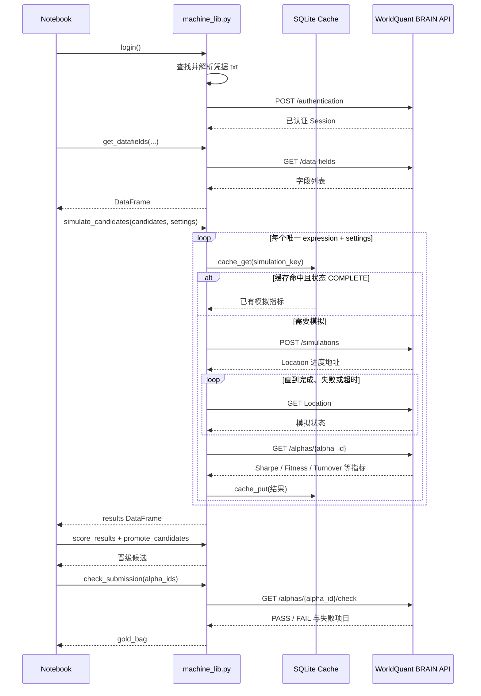
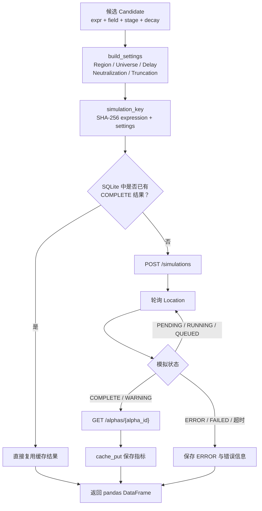
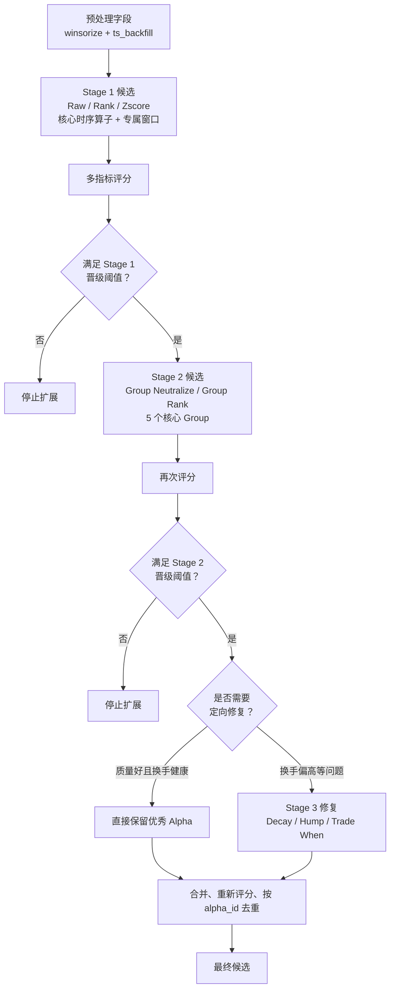
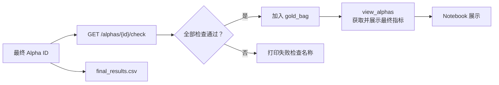

# WorldQuant BRAIN Alpha 自动遍历系统架构

## 1. 系统主链路



主流程可以概括为：

```text
Notebook
   ↓
machine_lib
   ↓
WorldQuant BRAIN API
   ↓
Simulation
   ↓
Alpha 筛选与晋级
   ↓
提交检查
   ↓
结果保存
```

## 2. Notebook 编排层

文件：`Alpha遍历_V2.ipynb`

Notebook 不实现底层 HTTP 和评分算法，主要负责设置参数、组织执行顺序和展示结果。



## 3. `machine_lib.py` 功能分层

| 层 | 主要函数 | 职责 |
|---|---|---|
| 登录认证 | `login`、`_find_credentials_file`、`_read_credentials_file` | 查找并解析账号密码，创建已认证的 `requests.Session` |
| HTTP 基础层 | `_request_with_retry`、`_get_json` | 超时、限流、重试和 JSON 获取 |
| 数据字段层 | `get_datasets`、`get_datafields`、`prepare_fields` | 获取数据集字段并构造预处理表达式 |
| Alpha 候选层 | `first_order_candidates`、`second_order_candidates`、`targeted_repair_candidates` | 生成 Stage 1–3 候选表达式和元数据 |
| 模拟设置层 | `build_settings`、`simulation_key` | 生成 BRAIN Settings，并计算缓存键 |
| 模拟执行层 | `simulate_candidates`、`_post_single_simulation`、`_wait_simulation`、`fetch_alpha_result` | 提交模拟、轮询进度、立即获取 Alpha 指标 |
| 缓存层 | `init_cache`、`cache_get`、`cache_put` | 用 SQLite 避免重复模拟并保存结果 |
| 筛选层 | `score_results`、`promote_candidates` | 多指标评分、阈值过滤、字段多样性晋级 |
| 提交检查层 | `get_check_submission_detailed`、`check_submission`、`view_alphas` | 检查提交条件并展示通过的 Alpha |

## 4. API 调用关系



## 5. Simulation 内部流程



缓存唯一性由以下组合决定：

```text
simulation_key = SHA-256(expression + 完整 settings)
```

因此表达式相同但 Region、Universe、Decay、Neutralization 或其他 Settings 不同时，仍会视为不同模拟。

## 6. Alpha 漏斗筛选



`score_results` 使用的指标权重：

| 指标 | 权重 |
|---|---:|
| 绝对 Sharpe | 35% |
| 绝对 Fitness | 25% |
| 绝对 Margin | 15% |
| Turnover Quality | 15% |
| 持仓覆盖数量 | 10% |

`promote_candidates` 在评分之外还会执行：

- 最低 Sharpe、Fitness 和持仓数量过滤。
- Turnover 上限过滤。
- 同一字段保留数量限制，维持字段多样性。
- 负 Sharpe 候选通过反转表达式统一方向。

## 7. 提交检查与结果产物



主要产物：

| 产物 | 内容 |
|---|---|
| `alpha_results.db` | 所有模拟缓存、状态、指标、候选元数据和错误信息 |
| `stage1_results.csv` | Stage 1 模拟及评分结果 |
| `stage2_results.csv` | Stage 2 模拟及评分结果 |
| `stage3_results.csv` | Stage 3 定向修复结果 |
| `final_results.csv` | 合并、评分和去重后的最终候选 |
| `gold_bag` | 通过 BRAIN submission check 的 Alpha ID 及自相关指标 |

## 8. 边界说明

- Notebook 是流程编排入口，`machine_lib.py` 是核心实现。
- 账号密码仅来自项目目录 txt，或在没有 txt 时来自环境变量；不会写入 Python 源码。
- SQLite 是模拟缓存，不替代 BRAIN API 的真实 Alpha 数据。
- Stage 1–3 是逐级缩小搜索空间的漏斗，不是对全部算子做无边界笛卡尔积。
- Submission Check 是最终质量门槛，不参与前面候选表达式的生成。
